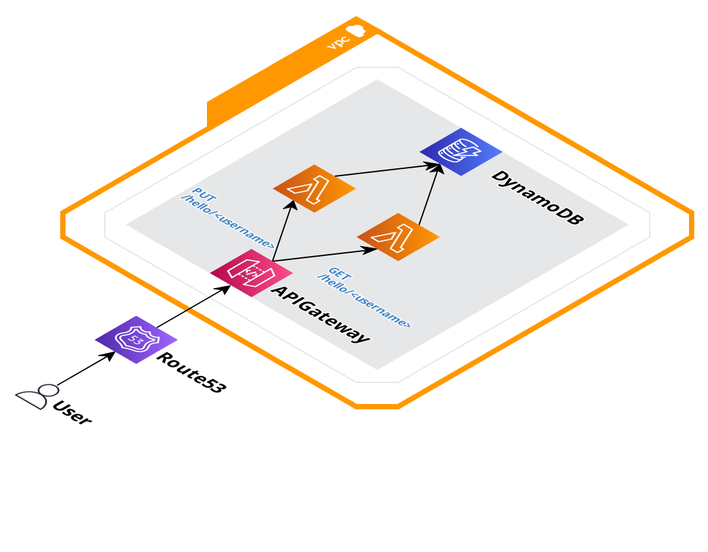

# go-birthday-api

## App running locally

### Solution
Creating an HTTP REST API Server in Go. You can find the implemented solution in `cmd/server_http` folder.

### Requirements
[Docker](https://www.docker.com/products/docker-desktop) and [docker-compose](https://docs.docker.com/compose/install/) tool

Technologies used in this project:

* [Golang 1.21](https://golang.org): Open source programming language
* [Docker: docker-compose](https://docs.docker.com/compose/)
* [Localstack](https://github.com/localstack/localstack): A fully functional local AWS cloud stack

### Quick Start and Run

1. Run in your terminal:

    $ `make dev && make logs`


    Exposed ports:

    * **HTTP server will be exposed on port `8080`**

### Endpoints
Returns hello birthday message for the given user
```bash
curl http://localhost:8080/hello/{username}
```
Saves/updates the given user’s name and date of birth in the database.
```bash
curl -X PUT -I -d '{"dateOfBirth":"2003-10-12"}'  http://localhost:8081/hello/{username}
```

## App deployment
### Solution
Changing the approach of the HTTP server. I created 2 Lambda functions for each endpoint. As a deployment, I used Serverless framework to deploy to AWS. You can find the app part solution in `cmd/lambda_get` and `cmd/lambda_put` folders.

### Requirements
* [Golang 1.21](https://golang.org): Open source programming language
* [Serverless framework](https://www.serverless.com/framework/docs/getting-started): Deploy APIs,.. apps to AWS Lambda easily.
* [Node.js](https://nodejs.org/): It's required for Serverless
* AWS account

### Quick Start and Deploy
1. Run in your terminal:

    $ `make deploy-aws`
    
    After running the above command you will get this output with accessible endpoints:

    ```
    endpoints:
        GET - https://xxxx.execute-api.us-east-1.amazonaws.com/dev/hello/{username}
        PUT - https://xxxx.execute-api.us-east-1.amazonaws.com/dev/hello{username}
    functions:
        getHello: go-birthday-api-dev-getHello (8.1 MB)
        addUser: go-birthday-api-dev-addUser (8.1 MB)
    ```

## Infrastructure
### Building a No-Downtime API Deployment

The primary approach for achieving a highly available API deployment leverages serverless technologies provided by AWS. Key components include:



**1) Amazon API Gateway:**

- **High Availability:** Ensures continuous accessibility by serving as the entry point for our API. It offers built-in redundancy and automatic scaling to handle traffic surges effectively.
- **Serverless:** Offers a low-cost solution.
- **CloudWatch:** Logs API calls, latencies, and error rates to Cloudwatch.
**Throttling:** It helps you manage traffic with throttling so that backend operations can withstand traffic spikes and denial of service attacks.


**2) AWS Lambda Functions:**

- **Serverless Efficiency:** Offers serverless computing, eliminating the need for managing EC2 instances. It automatically scales based on incoming requests, ensuring optimal performance.
- **Cost-Efficiency:** Lambda functions are cost-effective, as you only pay for the compute time used during request processing.
- **Autoscaling:** The individual Lambda functions for PUT and GET methods allow independent autoscaling, ensuring responsiveness to varying workloads.

**3) Amazon DynamoDB:**

- **Efficient Data Storage:** DynamoDB efficiently stores and manages the data, providing low-latency access for the API.
- **Scalability:** DynamoDB with on-demand capacity mode automatically scales to handle changes in data volume and request traffic. For this test, I used provisioned capacity mode with minimum capacity.

**Alternative Approach: Amazon EC2 Instances**

In an alternative approach, we can utilize Amazon Elastic Compute Cloud (EC2) instances to handle API requests. This setup offers flexibility and control over the underlying infrastructure but comes with additional management responsibilities. In this option, I'd use the http server solution instead of lambdas.


**Advantages of the Primary Approach:**
- Cost-Effective Serverless Model: Lambda functions are cost-efficient, as we pay only for actual compute usage.
- Low Administrative Overhead: Serverless technologies reduce operational overhead, allowing us to focus on development.

Please note that while Amazon Route 53 is included in the diagrams for more accessible endpoint URLs, it has not been implemented in the solutions of this test.
